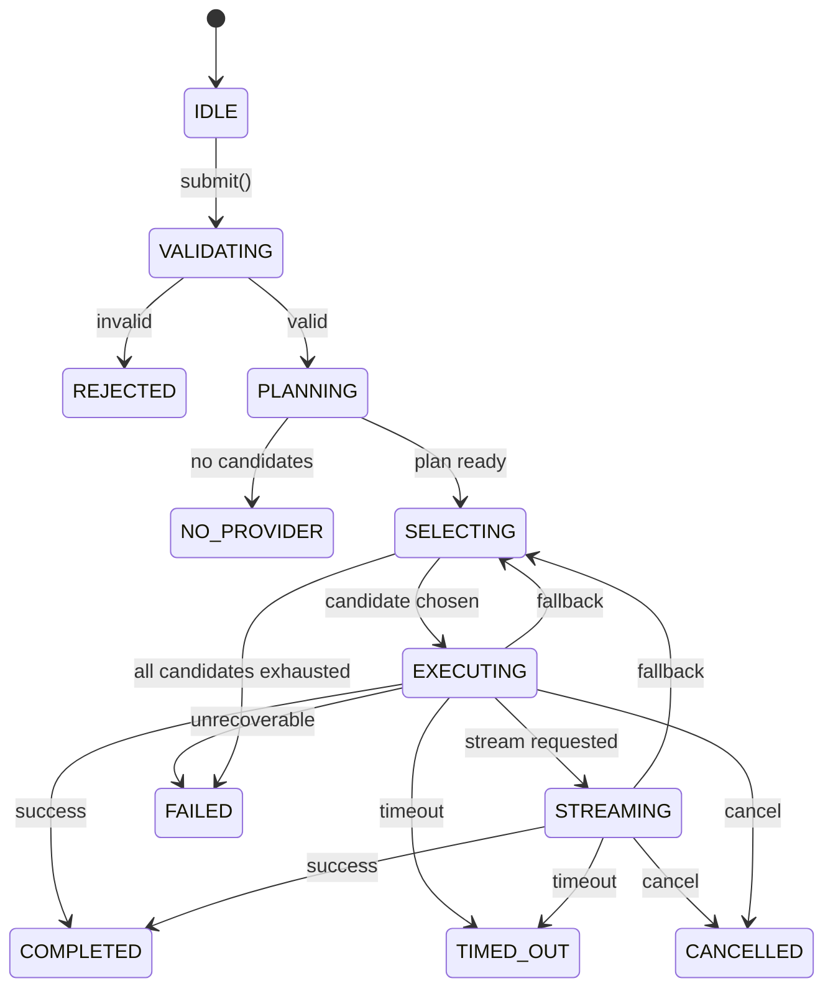
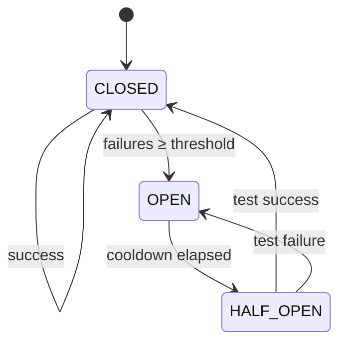
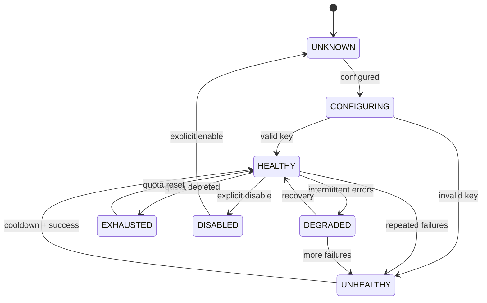

# State Model — Free LLM Inference Kernel

**Version:** 0.1.0  
**Scope:** Formal state machines for request, provider, circuit breaker, health, quota, cache, and plugin lifecycles.  
**Date:** 2026-07-18

---

## 1. Request Lifecycle State Machine

### States

| State | Description |
|-------|-------------|
| `IDLE` | Request object created, not yet submitted |
| `VALIDATING` | Core validation in progress |
| `PLANNING` | Planner selecting candidates |
| `SELECTING` | A candidate is being chosen for execution |
| `EXECUTING` | Network request in flight |
| `STREAMING` | Streaming response in progress |
| `COMPLETED` | Response received and valid |
| `FAILED` | All candidates exhausted or unrecoverable error |
| `CANCELLED` | Caller cancelled the request |
| `TIMED_OUT` | Request exceeded total timeout |
| `REJECTED` | Input failed validation |
| `NO_PROVIDER` | No provider matched requirements |

### State Transitions

```
[IDLE]
  │ submit()
  ▼
[VALIDATING] ──(invalid)──▶ [REJECTED]
  │ (valid)
  ▼
[PLANNING] ──(no candidates)──▶ [NO_PROVIDER]
  │ (plan ready)
  ▼
[SELECTING]
  │
  ▼
[EXECUTING] ──(timeout)──▶ [TIMED_OUT]
  │ (stream requested)
  ▼
[STREAMING] ──(timeout)──▶ [TIMED_OUT]
  │
  ├─(success)──────────────▶ [COMPLETED]
  ├─(non-retryable error)───▶ [FAILED]
  ├─(retry same provider)───▶ [EXECUTING]
  ├─(fallback)────────────▶ [SELECTING]
  ├─(all candidates failed)─▶ [FAILED]
  └─(cancel)───────────────▶ [CANCELLED]
```

### Invalid / Race-Prone Transitions

| # | Invalid Transition | Why Dangerous | Guard |
|---|-------------------|--------------|-------|
| 1 | `COMPLETED → EXECUTING` | Duplicate execution | Terminal states are absorbing |
| 2 | `FAILED → SELECTING` | Infinite loop | `FAILED` is terminal |
| 3 | `EXECUTING → PLANNING` | Plan changes mid-flight | Freeze plan on `EXECUTING` entry |
| 4 | `SELECTING → SELECTING` (same iteration) | Busy-loop with no execution | Require `EXECUTING` between selections |
| 5 | `IDLE → COMPLETED` (cache hit) | Must still validate request and plan | Cache returns a `Response` only after full planning path |
| 6 | `TIMED_OUT → COMPLETED` | Late response accepted after timeout | Timeout is terminal; late response is dropped |
| 7 | `CANCELLED → STREAMING` | Cancellation ignored | Check cancellation token before yielding each chunk |

### Invariants

- Every request reaches exactly one terminal state.
- Terminal states: `COMPLETED`, `FAILED`, `TIMED_OUT`, `CANCELLED`, `REJECTED`, `NO_PROVIDER`.
- Only one adapter executes at a time per `trace_id`.

---

## 2. Provider Lifecycle State Machine

### States

| State | Description |
|-------|-------------|
| `UNKNOWN` | Provider metadata loaded, no health data |
| `CONFIGURING` | API key detected, validating |
| `HEALTHY` | Health check passed, ready to use |
| `DEGRADED` | Some models failing or slow |
| `UNHEALTHY` | Repeated failures |
| `DISABLED` | Explicitly disabled |
| `EXHAUSTED` | Quota depleted |
| `REMOVED` | No longer in registry |

### State Transitions

```
[UNKNOWN]
  │ configured?
  ▼
[CONFIGURING] ──(invalid key)──▶ [UNHEALTHY]
  │ (valid key)
  ▼
[HEALTHY] ──(intermittent errors)──▶ [DEGRADED]
  │
  ├─(too many consecutive failures)──▶ [UNHEALTHY]
  ├─(quota exhausted)────────────────▶ [EXHAUSTED]
  ├─(explicit disable)───────────────▶ [DISABLED]
  └─(removed from registry)──────────▶ [REMOVED]

[DEGRADED] ──(recovery)──▶ [HEALTHY]
[DEGRADED] ──(more failures)──▶ [UNHEALTHY]

[UNHEALTHY] ──(recovery after cooldown)──▶ [HEALTHY]
[UNHEALTHY] ──(removed)─────────────────▶ [REMOVED]

[EXHAUSTED] ──(new day / quota reset)──▶ [HEALTHY]
[DISABLED] ──(explicit enable)─────────▶ [UNKNOWN]
```

### Invariants

- A provider in `HEALTHY` or `DEGRADED` state may appear in `ExecutionPlan` candidates.
- `UNHEALTHY`, `EXHAUSTED`, `DISABLED`, and `REMOVED` providers are excluded from planning.
- `EXHAUSTED` → `HEALTHY` transition occurs only on quota reset or explicit quota update.

---

## 3. Circuit Breaker State Machine

Per-provider circuit breaker.

### States

| State | Description |
|-------|-------------|
| `CLOSED` | Normal operation, requests allowed |
| `OPEN` | Too many failures, requests blocked |
| `HALF_OPEN` | Testing if provider has recovered |

### Transitions

```
[CLOSED] ──(failures ≥ threshold)──▶ [OPEN]
[OPEN] ──(cooldown elapsed)──▶ [HALF_OPEN]
[HALF_OPEN] ──(test success)──▶ [CLOSED]
[HALF_OPEN] ──(test failure)──▶ [OPEN]
[CLOSED] ──(success)──▶ [CLOSED]  # resets failure count
```

### Parameters

| Parameter | Default | Description |
|-----------|---------|-------------|
| `failure_threshold` | 5 | Consecutive failures before opening |
| `cooldown_ms` | 30000 | Time before half-open |
| `half_open_max_calls` | 1 | Number of test calls in half-open |
| `success_threshold` | 2 | Successes in half-open to close |

### Invariants

- Circuit breaker state is per-provider, per-process.
- `OPEN` state rejects requests immediately without network call.
- `HALF_OPEN` allows only a limited number of probe requests.

---

## 4. Health Lifecycle State Machine

Health is derived from circuit breaker, latency, and explicit health checks.

### States

| State | Description |
|-------|-------------|
| `HEALTHY` | Passing health checks and low failure rate |
| `SLOW` | High latency but low failure rate |
| `FLAPPING` | Rapidly alternating healthy/unhealthy |
| `UNHEALTHY` | Failing health checks or circuit open |

### Transitions

```
[HEALTHY] ──(latency > threshold)──▶ [SLOW]
[HEALTHY] ──(failures spike)──────▶ [UNHEALTHY]
[SLOW] ──(latency normal)─────────▶ [HEALTHY]
[SLOW] ──(failures spike)─────────▶ [UNHEALTHY]
[UNHEALTHY] ──(stable recovery)───▶ [HEALTHY]
[Any] ──(rapid transitions)──▶ [FLAPPING]
[FLAPPING] ──(stable period)────▶ [HEALTHY] or [UNHEALTHY]
```

### Invariants

- Health transitions use hysteresis to prevent flapping.
- Health state affects provider scoring, not routing correctness.

---

## 5. Quota Lifecycle State Machine

### States

| State | Description |
|-------|-------------|
| `AVAILABLE` | Quota remaining |
| `LOW` | Less than 20% of daily limit remains |
| `EXHAUSTED` | No quota remaining |
| `UNKNOWN` | No limit configured |

### Transitions

```
[AVAILABLE] ──(usage > 80% of limit)──▶ [LOW]
[LOW] ──(usage ≥ limit)────────────────▶ [EXHAUSTED]
[EXHAUSTED] ──(new day / reset)───────▶ [AVAILABLE]
[UNKNOWN] ──(limit configured)────────▶ [AVAILABLE]
```

### Invariants

- Quota state is tracked per provider per model per day.
- Quota state is a snapshot; real provider-side quota may differ.
- `EXHAUSTED` provider is excluded from planning.

---

## 6. Cache Lifecycle State Machine

### States

| State | Description |
|-------|-------------|
| `MISS` | Key not in cache |
| `HIT` | Valid cached response |
| `STALE` | Cached response expired TTL |
| `INVALID` | Cache entry failed validation |

### Transitions

```
[MISS] ──(write)──▶ [HIT]
[HIT] ──(TTL expired)──▶ [STALE]
[STALE] ──(revalidate success)──▶ [HIT]
[STALE] ──(revalidate fail)─────▶ [MISS]
[HIT] ──(validation fail)─────▶ [INVALID]
[INVALID] ──(delete)──────────▶ [MISS]
```

### Invariants

- Cache key is deterministic from `Request` fields.
- Cache `HIT` must produce a valid `Response`.
- Streaming requests are not cached unless explicitly configured.

---

## 7. Session / Conversation Lifecycle

### States

| State | Description |
|-------|-------------|
| `ACTIVE` | Session has ongoing conversation |
| `IDLE` | No recent activity |
| `EXPIRED` | TTL elapsed |
| `PERSISTED` | Saved to store |
| `LOADED` | Restored from store |

### Transitions

```
[ACTIVE] ──(inactivity timeout)──▶ [IDLE]
[IDLE] ──(new message)─────────▶ [ACTIVE]
[IDLE] ──(TTL elapsed)─────────▶ [EXPIRED]
[ACTIVE] ──(save call)───────────▶ [PERSISTED]
[PERSISTED] ──(load call)───────▶ [LOADED]
[LOADED] ──(new message)───────▶ [ACTIVE]
[EXPIRED] ──(purge)────────────▶ [terminal]
```

### Invariants

- Session messages are appended, never mutated.
- Session TTL is configurable per session.

---

## 8. Plugin Lifecycle State Machine

### States

| State | Description |
|-------|-------------|
| `DISCOVERED` | Plugin file found |
| `LOADING` | Import in progress |
| `LOADED` | Plugin imported successfully |
| `VALIDATED` | Plugin implements required interface |
| `ACTIVE` | Plugin registered and running |
| `FAILED` | Plugin load or validation failed |
| `DISABLED` | Plugin explicitly disabled |

### Transitions

```
[DISCOVERED] ──(import)──▶ [LOADING]
[LOADING] ──(success)──────▶ [LOADED]
[LOADING] ──(error)────────▶ [FAILED]
[LOADED] ──(interface check)──▶ [VALIDATED]
[VALIDATED] ──(register)──────▶ [ACTIVE]
[VALIDATED] ──(interface mismatch)──▶ [FAILED]
[ACTIVE] ──(disable)──▶ [DISABLED]
[DISABLED] ──(enable)─▶ [VALIDATED]
```

### Invariants

- A plugin in `FAILED` state cannot be enabled.
- Plugins cannot modify Core types.
- Plugin load errors do not crash the kernel.

---

## 9. Composite State Interactions

### Interaction: Request + Circuit Breaker

- Before `EXECUTING`, check provider circuit breaker.
- If `OPEN`, skip to next candidate without network call.
- If `HALF_OPEN`, consume a probe slot.

### Interaction: Request + Quota

- Before selecting candidate, check quota state.
- If `EXHAUSTED`, remove from candidate list.
- If `LOW`, penalize score.

### Interaction: Request + Cache

- During `PLANNING`, cache may short-circuit to `COMPLETED`.
- On `COMPLETED`, cache stores `Response`.
- Cache lookup must respect `stream` flag and `response_format`.

### Interaction: Provider + Health

- Health state is updated from `ExecutionResult`.
- `UNHEALTHY` providers trigger circuit breaker transition.
- `DEGRADED` providers affect scoring, not availability.

### Interaction: Streaming + Cancellation

- `CANCELLED` state must be checked before each chunk yield.
- If cancelled mid-stream, transition to `CANCELLED` and close connection.

---

## 10. State Ownership Table

| State Machine | Owner Layer | Persistence | Cross-Process? | Thread-Safe? |
|---------------|-------------|-------------|----------------|--------------|
| Request | Runtime | Trace log only | No | Yes |
| Provider | Planner (metadata) / Runtime (health) | Config file | Partial (metadata) | Yes |
| Circuit Breaker | Runtime | In-memory | No | Yes |
| Health | Runtime | In-memory + optional Metrics extension | No | Yes |
| Quota | Extensions (UsageStore) | SQLite/file/Redis | Yes (with shared store) | Yes |
| Cache | Extensions (CacheStore) | Memory/disk/Redis | Optional | Yes |
| Session | Extensions (SessionStore) | SQLite/Redis | Yes | Yes |
| Plugin | Extensions | Config file | No | N/A |

---

## 11. State Validation Checklist

Before any state transition, the following must be checked:

1. Is the transition allowed from the current state?
2. Are preconditions for the target state satisfied?
3. Does the transition maintain all invariants?
4. Is the change logged with `trace_id`?
5. Are observers (Extensions) notified if applicable?
6. Is concurrent access safe?

---

## 12. Mermaid State Diagrams

### Request State Diagram



### Circuit Breaker State Diagram



### Provider State Diagram


